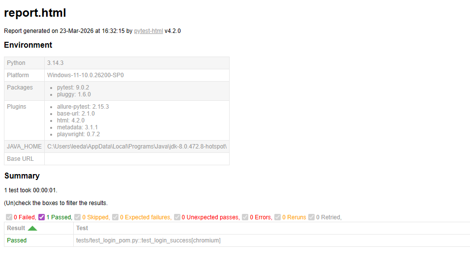

Playwright E2E Test Automation (Sauce Demo)

1. 프로젝트 개요
Playwright와 Python을 활용하여 쇼핑몰 주요 시나리오를 자동화한 프로젝트입니다. 
단순 스크립트 나열이 아닌, 유지보수를 고려한 POM(Page Object Model) 구조로 설계했습니다.

2. 설계 및 리팩토링 기록
- Step 1~4 (legacy/): 절차적 스크립트 작성 및 시행착오 기록
- Step 5 (pages/, tests/): POM 구조 적용 및 로직 분리 (최종)
- 학습 과정에서 발생한 코드 중복을 제거하고, 로케이터 관리를 효율화하는 데 집중했습니다.

3. 테스트 결과 리포트 (HTML)
실행 결과 분석을 위해 pytest-html을 연동하여 리포트를 생성하도록 구성했습니다.
(아래 이미지는 실제 테스트 패스 결과 캡처본입니다.)

4. 프로젝트 구조
- pages/: 페이지 객체 모델 (로케이터 및 액션 메서드)
- tests/: POM 기반 시나리오 테스트
- legacy/: 리팩토링 이전 단계별 스크립트 보관
- images/: 결과 리포트 및 문서용 이미지

5. 실행 가이드
필요 라이브러리 설치:
`pip install playwright pytest pytest-html`

브라우저 엔진 설치:
`playwright install`

테스트 실행 및 리포트 생성:
`python -m pytest --html=report.html --self-contained-html`