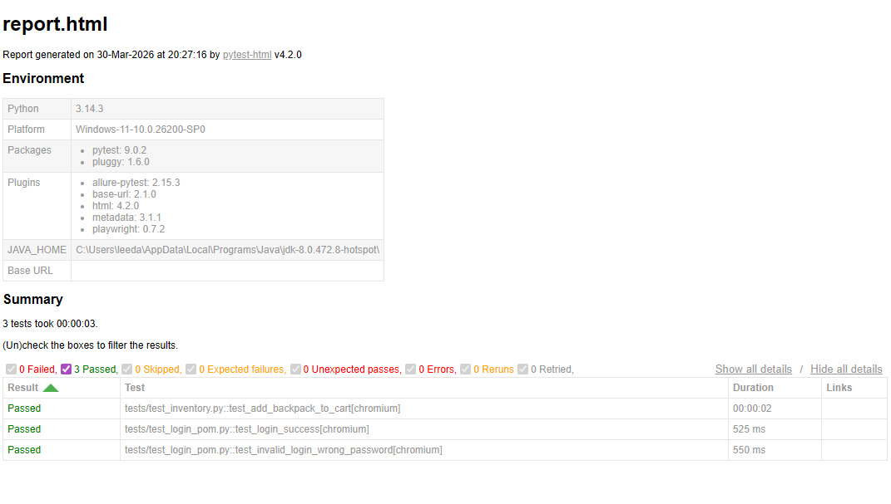

# Playwright E2E Automation Framework

## 프로젝트 개요
본 프로젝트는 대규모 커머스 도메인의 결제 무결성을 방어하기 위해 구축된 엔드투엔드 테스트 자동화 프레임워크입니다.
단순한 UI 기능 확인을 넘어, 사용자의 로그인부터 최종 결제 승인까지 이어지는 전체 비즈니스 로직을 통제합니다.
유지보수성과 확장성을 극대화하기 위해 페이지 객체 모델(POM) 아키텍처를 적용했으며, 정적 타입 힌트를 도입하여 코드의 안정성을 확보했습니다.

## 기술 스택 및 아키텍처
* **언어 및 프레임워크**: Python 3, Playwright, Pytest
* **설계 패턴**: Page Object Model 아키텍처
* **아키텍처 특징**: 비즈니스 로직과 UI 로케이터의 완벽한 물리적 분리
* **타입 안정성**: 파이썬 정적 타입 힌트 도입을 통한 런타임 에러 사전 차단 및 IDE 자동 완성 극대화

## E2E 시나리오 커버리지
현재 구축된 메인 파이프라인은 커머스 시스템의 가장 핵심적인 구매 궤도를 무결점으로 검증합니다.
1. **자격 증명 검증**: 유효한 계정 데이터를 통한 시스템 접근 및 세션 획득
2. **재고 통제**: 특정 상품 식별 및 장바구니 적재
3. **결제 정보 주입**: 배송지 폼 데이터 입력 및 렌더링 상태 단언
4. **금액 정합성 검증**: 최종 결제 요약 화면에서의 청구 금액 교차 검증
5. **주문 승인 단언**: 결제 완료 페이지의 성공 메시지 및 종착지 URL 무결성 확인

## 테스트 실행 결과 증명


## 디렉토리 구조
* `pages/`: 브라우저의 물리적 화면 전환 단위로 파편화된 독립적인 페이지 객체 모듈
* `tests/`: 페이지 객체들을 조립하여 전체 구매 사이클을 제어하는 비즈니스 시나리오 스크립트
* `reports/`: 파이프라인 구동 후 자동 렌더링되는 HTML 테스트 결과 보고서

## 실행 파이프라인 가이드
```bash
# 필수 의존성 및 브라우저 엔진 적재
pip install playwright pytest pytest-html
playwright install

# 헤드리스 E2E 전체 궤도 검증 및 보고서 추출
python -m pytest --html=report.html --self-contained-html

# 시각적 렌더링 디버깅 (실행 간격 0.5초 제어)
python -m pytest tests/test_inventory.py --headed --slowmo 500
